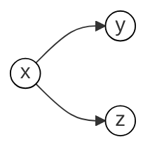

# Delayed sampling

A heuristic called *delayed sampling* is used to implement automatic marginalization and automatic conditioning. This has a small limitation: it allows automatic marginalization and automatic conditioning for *chains* of random variables, but not *trees*. Consider the following:
```birch
x ~ Gamma(2.0, 1.0);
y ~ Poisson(x);
z ~ Poisson(x);
```
We can see that this defines the directed graphical model:

But this is a tree (the most basic), and delayed sampling cannot marginalize out all the variables in a tree. Instead, it proceeds step by step as follows:

1. `#!birch x ~ Gamma(1.0, 2.0);`
   `x` is trivially marginalized out.
   ```mermaid
   graph LR
    x((x))
    style x fill:#fff,stroke:#000
   ```

2. `#!birch y ~ Poisson(x);`
   `x` is marginalized out, `y` is trivially marginalized out. There is a single chain of marginalized variables.
   ```mermaid
   graph LR
    x((x))
    y((y))
    style x fill:#fff,stroke:#000
    style y fill:#fff,stroke:#000
    x --> y
   ```

3. `#!birch z ~ Poisson(x);`
   Adding `z` to the graph would create a tree of marginalized variables. To avoid this, the delayed sampling heuristic simulates a value for `y` (now shown in grey). This will break the first branch of the tree that would otherwise be formed. Now `x` is still marginalized out, but its distribution updated given the value that was simulated for `y`.
   ```mermaid
   graph LR
     x((x))
     y((y))
     style x fill:#fff,stroke:#000
     style y fill:#aaa,stroke:#000
     x --> y
   ```

4. Now the new node is added; `x` remains marginalized out, `y` is not, `z` is trivially marginalized out. There is now only a single chain of marginalized variables.
   ```mermaid
   graph LR
     x((x))
     y((y))
     z((z))
     style x fill:#fff,stroke:#000
     style y fill:#aaa,stroke:#000
     style z fill:#fff,stroke:#000
     x --> y
     x --> z
   ```

Delayed sampling over Gaussian variables yields some common use-cases without explicit coding. Consider the following linear-Gaussian state-space model, where the `x` would typically be latent, and the `y` observed:
```birch
x[1] ~ Gaussian(0.0, 4.0);
y[1] ~ Gaussian(b*x[1], 1.0);
for t in 2..4 {
  x[t] ~ Gaussian(a*x[t - 1], 4.0);
  y[t] ~ Gaussian(b*x[t], 1.0);
}
```

We see the previous steps repeated on each iteration of the loop: 

1. At the start of the $t$th iteration, we have the previous latent state and observation, both `x[t-1]` and `y[t-1]` are marginalized out.
   ```mermaid
   graph LR
     xtm1(("x[t-1]"))
     ytm1(("y[t-1]"))
     style xtm1 fill:#fff,stroke:#000
     style ytm1 fill:#fff,stroke:#000
     xtm1 --> ytm1
   ```

2. `#!birch x[t] ~ Gaussian(a*x[t - 1], 4.0);`
   Adding `x[t]` to the graph would create a tree of marginalized variables, so `y[t-1]` is simulated to break the tree (or it may already have a value, as in most state-space models).
   ```mermaid
   graph LR
     xtm1(("x[t-1]"))
     ytm1(("y[t-1]"))
     style xtm1 fill:#fff,stroke:#000
     style ytm1 fill:#aaa,stroke:#000
     xtm1 --> ytm1
   ```
3. Now the new node for the latent state is added; `x[t-1]` and `x[t]` remain marginalized out.
   ```mermaid
   graph LR
     xtm1(("x[t-1]"))
     ytm1(("y[t-1]"))
     xt(("x[t]"))
     style xtm1 fill:#fff,stroke:#000
     style ytm1 fill:#aaa,stroke:#000
     style xt fill:#fff,stroke:#000
     xtm1 --> ytm1
     xtm1 --> xt
   ```

4. Finally the new node for the observation is added; `x[t-1]`, `x[t]` and `y[t]` remain marginalized out, ready for the next iteration of the loop.
   ```mermaid
   graph LR
     xtm1(("x[t-1]"))
     ytm1(("y[t-1]"))
     xt(("x[t]"))
     yt(("y[t]"))
     style xtm1 fill:#fff,stroke:#000
     style ytm1 fill:#aaa,stroke:#000
     style xt fill:#fff,stroke:#000
     style yt fill:#fff,stroke:#000
     xtm1 --> ytm1
     xtm1 --> xt
     xt --> yt
   ```

In fact, the operations automatically performed for this example are precisely those of the Kalman filter, without having to code them by hand.
