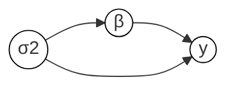
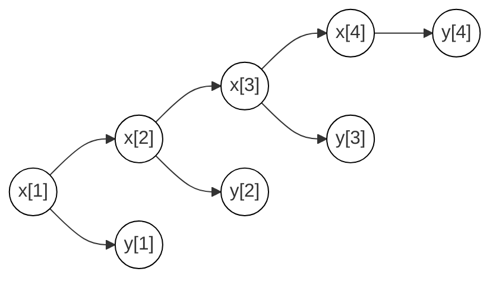

# Graphical models

We can think of any particular run of a program as generating a directed graphical model. Consider, for example, a simple linear regression model, written programmatically as:
```birch
σ2 ~ InverseGamma(3.0, 0.4);
β ~ Gaussian(vector(0.0, P), diagonal(σ2, P));
y ~ Gaussian(X*β, σ2);
```
We can write this model mathematically as:

$$p(\mathrm{d}\sigma^2, \mathrm{d}\beta, \mathrm{d}y) = p(\mathrm{d}\sigma^2) p(\mathrm{d}\beta \mid \sigma^2) p(\mathrm{d}y \mid \beta, \sigma^2),$$

and graphically as:


Each line in the programmatic representation (that uses the `~` operator) defines a new factor in the mathematical representation, and a new node in the graphical representation. In programmatic representation, the dependencies of each random variable contribute to the arguments to its corresponding distribution; in the mathematical representation they appear to the right of the bar ($\mid$) in the corresponding factor; in the graphical representation they connect with incoming arrows to the corresponding node.

Many useful models can be represented in these three ways. Consider a linear-Gaussian state-space model (hidden Markov model), represented programmatically as:
```birch
x[1] ~ Gaussian(0.0, 4.0);
y[1] ~ Gaussian(b*x[1], 1.0);
for t in 2..4 {
  x[t] ~ Gaussian(a*x[t - 1], 4.0);
  y[t] ~ Gaussian(b*x[t], 1.0);
}
```
mathematically as:

$$p(\mathrm{d}x_{1:T}, \mathrm{d}y_{1:T}) = p(\mathrm{d}x_1)p(\mathrm{d}y_1\mid x_1) \prod_{t=2}^T p(\mathrm{d}x_t \mid x_{t-1})p(\mathrm{d}y_t \mid x_t).$$

and graphically as:

