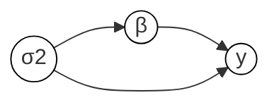

# Introduction

Probabilistic models can be represented in numerous ways. We can think of *mathematical* representations, using the notations of probability, or *graphical* representations, using the notations of Bayesian networks (directed graphical models), Markov random fields (undirected graphical models), and factor graphs. Similarly, we can think of *programmatic* representations: the way in which a probabilistic model can be represented in a programming language.

<table>
  <tr>
    <th>Mathematical</th>
    <td>

$$p(\mathrm{d}\sigma^2) p(\mathrm{d}\beta \mid \sigma^2) p(\mathrm{d}y \mid \beta, \sigma^2)$$

    </td>
  </tr>
  <tr>
    <th>Graphical</th>
    <td>

    </td>
  </tr>
  <tr>
    <th>Programmatic</th>
    <td>
```birch
σ2 ~ InverseGamma(3.0, 0.4);
β ~ Gaussian(0.0, σ2);
y ~ Gaussian(X*β, σ2);
```
    </td>
  </tr>
</table>

In this section we look at the building blocks of programmatic models in Birch, and how these combine to enable computations such as automatic differentiation, automatic marginalization, automatic conditioning and, ultimately, probabilistic inference.
